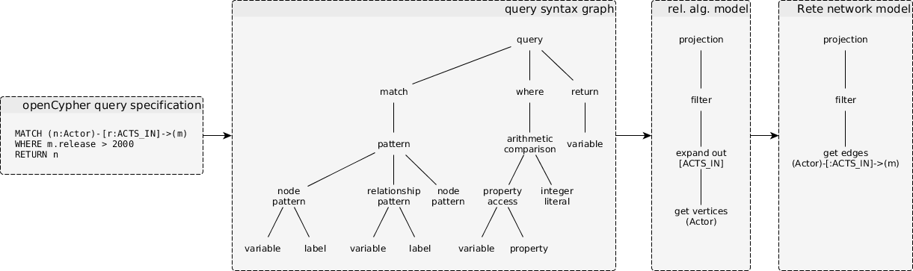

# ingraph workflow

## Processes (yellow)

* **query parser:** [Xtext](https://eclipse.org/Xtext/)-based parser.
* **Cypher to relational algebra transformer:** [Xtend](http://www.eclipse.org/xtend/)-based transformation from syntax graph to a relational algebra tree.
* **relational algebra optimizer:** query optimizer using graph rewriting with [VIATRA-DSE](https://wiki.eclipse.org/VIATRA/DSE).
* **relational algebra to Rete network transformer:** transforms the relational algebra tree to a Rete network using [VIATRA Query](https://wiki.eclipse.org/VIATRA/Query) patterns.

## Artifacts (blue)

* **openCypher query specification:** the query as a string.
* **query syntax graph:** the abstract syntax graph of the query.
* **relational algebra model:** query model using the extended operators of relational algebra, defined in [Xcore](https://wiki.eclipse.org/Xcore). For the operators, see our [openCypher report](docs.inf.mit.bme.hu/ingraph/pub/opencypher-report.pdf).
* **Rete network model:** a [Rete network](https://inf.mit.bme.hu/en/research/publications/incquery-d-distributed-incremental-model-query-framework-cloud) for incremental query evaluation defined in [Xcore](https://wiki.eclipse.org/Xcore). Also see our [openCypher report](docs.inf.mit.bme.hu/ingraph/pub/opencypher-report.pdf) for details.

## Example

