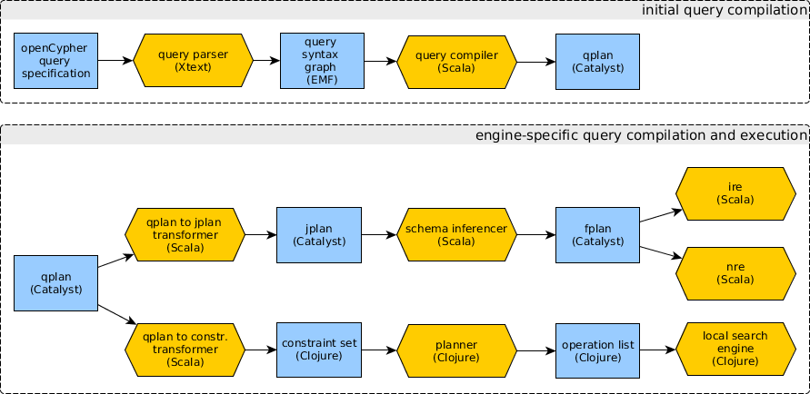

# ingraph workflow

## Initial query compilation

* :page_facing_up: `openCypher query specification`: the query as a string.
* :hourglass_flowing_sand: `query parser`: an [Xtext](https://eclipse.org/Xtext/)-based parser, using the [openCypher grammar of the Slizaa project](https://github.com/slizaa/slizaa-opencypher-xtext).
* :page_facing_up: `query syntax graph`: the abstract syntax graph of the query, represented in an EMF model.
* :hourglass_flowing_sand: `compiler`: transforms the syntax graph to a query plan.
* :page_facing_up: `qplan [unresolved]`: a query plan in relational graph algebra without resolved variables for aliases (e.g. in `WITH x AS y RETURN y.a AS b`).
* :hourglass_flowing_sand: `resolver`: resolves unresolved variables by tracking aliases.
* :page_facing_up: `qplan [resolved]`: a query plan in relational graph algebra with resolved variables.

## Engine-specific query compilation and execution

* relational engines:
  * :hourglass_flowing_sand: `qplan to nplan transformer`: transforms the query plan to a join-based plan that can be evaluated with relational techniques.
  * :page_facing_up: `nplan`: a query plan in join-based algebra.
  * :hourglass_flowing_sand: `schema inferencer`: transformations a join-based plan to a flat plan that contains properties required for computations.
  * :page_facing_up: `fplan`: a query plan in (join-based) flat relational algebra.
    * :hourglass_flowing_sand: `ire`: incremental relational engine.
    * :hourglass_flowing_sand: `nre`: a naive relational engine.
* search-based engine:
  * :hourglass_flowing_sand: `qplan to constraints transformer`: transforms the query plan to a set of constraints.
  * :page_facing_up: `constraints`: Datalog-style constraints that describe the query.
  * :hourglass_flowing_sand: `planner`: transforms the query plan to a list of operations.
  * :page_facing_up: `operations`: operations that define the search plan for the local search engine.
  * :hourglass_flowing_sand: `local search engine`: an executor for local search.
